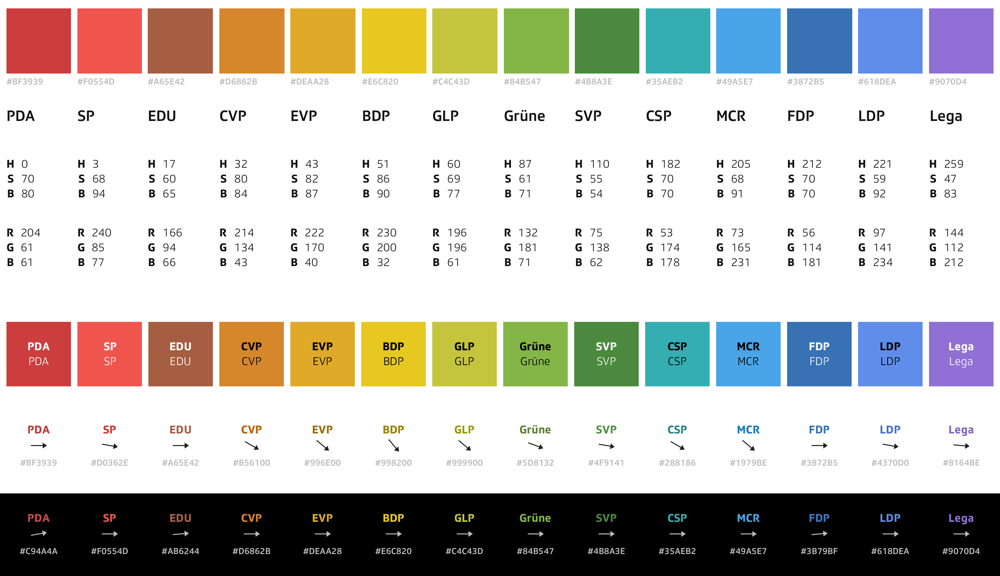

# Swiss Party Colors

This package offers party colors for most parties in Switzerland. Currently, **over 50 parties** have a corresponding color while another thirty parties are mentioned but have a grey color as they did not make a lot of votes in the past elections.


## What's defined?

For each party, the following attributes are defined:

- **Abbreviation**: or short `abbr` in German, French or Italian
- **Name**: the full name of the party in German, French or Italian
- **Color**: the main color that can be used for data visualization
- **Font Color**: a font color to use for text on white backgrounds
- **Font Color on Black**: a font color to use for text on black backgrounds


#### Accessibility in mind

The font colors have the same hue as the main colors but a different lightness. They have been chosen so that the contrast to the background is at least **1 to 4.5** according to [WebAIM](https://webaim.org/resources/contrastchecker/). That means they can be used with a font size of `18.66px` while conforming to the WCAG Level **AA**.


## Preview



This is how the colors for 14 of the most important parties in Switzerland look like. The abbreviations on the image are in German.

The colors have been chosen paying attention to the original color the parties use in their corporate design (mainly their logo). Secondly the colors were defined with the visual weight in mind. The lightness of all colors should be within a certain range so that no color looks heavier / more intense than any other. It was not possible that all colors have the same lightness in the HSL color system, but they are all not too bright and not too dark so that they can be used on dark and bright backgrounds:


## Collaboration

The package downloads the color definitions from this [Google Spreadsheet](https://docs.google.com/spreadsheets/d/1PCD3se4Nc4ME-i391yPYyAlLdgtXoZJFoJy_6Mlf7BY). Instead of making a pull request in this repository, feel free to add comments in the spreadsheet. SRF Data will update this repository after the spreadsheet has changed.


## API

If you want to use the colors in your frontend javascript development, you can install the package as a node module:

```
npm install swiss-party-colors
yarn add swiss-party-colors
```

Afterwards, import the function you want to use in the language of choice:

```
import { getPartyDE as getParty } from 'swiss-party-colors'
import { getPartyNameDE as getPartyName } from 'swiss-party-colors'
import { getPartyColorDE as getPartyColor } from 'swiss-party-colors'
import { getBlackOrWhiteDE as getBlackOrWhite } from 'swiss-party-colors'
import { getPartyFontColorDE as getPartyFontColor } from 'swiss-party-colors'
import { getPartyFontColorOnBlackDE as getPartyFontColorOnBlack } from 'swiss-party-colors'
```

or use the generic version, in cases where the language is set on runtime:

```
import { getParty } from 'swiss-party-colors'
import { getPartyName } from 'swiss-party-colors'
import { getPartyColor } from 'swiss-party-colors'
import { getBlackOrWhite } from 'swiss-party-colors'
import { getPartyFontColor } from 'swiss-party-colors'
import { getPartyFontColorOnBlack } from 'swiss-party-colors'
```

#### `getParty(abbreviation)` (generic: `getParty(language, abbreviation)`)

Returns an object for a given party abbreviation with the following properties:

- `abbr`: the abbreviation itself
- `name`: the name of the party
- `color`: the main color as a hex code
- `blackOrWhite`: black or white as a hex code
- `fontColor`: the font color as a hex code
- `fontColorOnBlack`: the font color for dark backgrounds as a hex code

#### `getPartyName(abbreviation)` (generic: `getPartyName(language, abbreviation)`)

Returns the full party name for a given party abbreviation

#### `getPartyColor(abbreviation)` (generic: `getPartyColor(language, abbreviation)`)

Returns the the main color as a hex code for a given party abbreviation

#### `getBlackOrWhite(abbreviation)` (generic: `getBlackOrWhite(language, abbreviation)`)

Returns black or white as a hex code for a given party abbreviation

#### `getPartyFontColor(abbreviation)` (generic: `getPartyFontColor(laguage, abbreviation)`)

Returns the font color as a hex code for a given party abbreviation

#### `getPartyFontColorOnBlack(abbreviation)` (generic: `getPartyFontColorOnBlack(language, abbreviation)`)

Returns the font color for dark backgrounds as a hex code for a given party abbreviation


## Lizenz

<a rel="license" href="http://creativecommons.org/licenses/by-sa/4.0/"></a><br /><span xmlns:dct="http://purl.org/dc/terms/" href="http://purl.org/dc/dcmitype/Dataset" property="dct:title" rel="dct:type">swiss-party-colors</span> by <a xmlns:cc="http://creativecommons.org/ns#" href="https://github.com/srfdata/swiss-party-colors" property="cc:attributionName" rel="cc:attributionURL">SRF Data</a> is licensed under a <a rel="license" href="http://creativecommons.org/licenses/by-sa/4.0/">Creative Commons Namensnennung - Attribution-ShareAlike 4.0 International (CC BY-SA 4.0)</a>.
